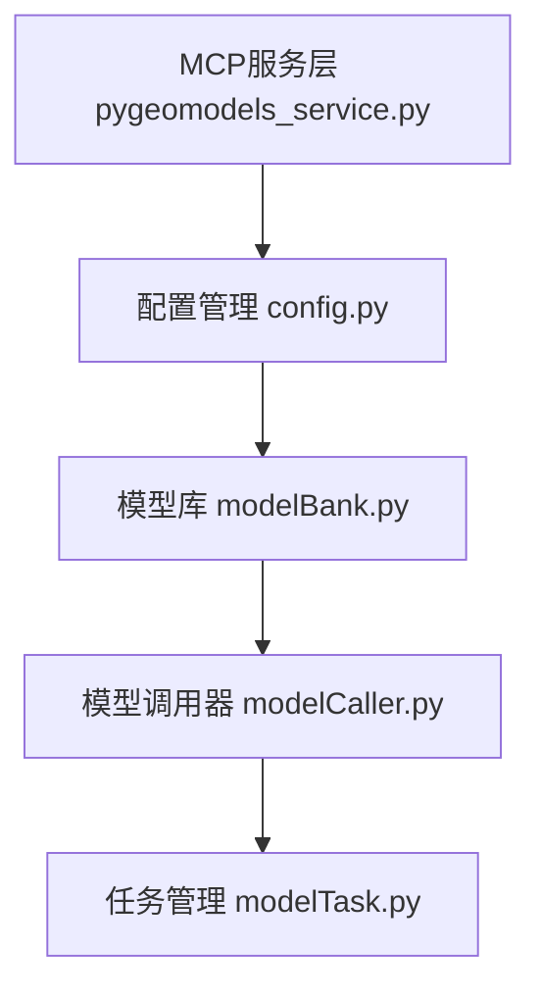

# PyGeoModels MCP服务代码文档

## 概述

PyGeoModels MCP服务是一个基于FastMCP框架的地理模型调用服务，为LLM提供地理空间建模工具的访问接口。该服务封装了地理模型的调用、状态查询和日志管理等功能。

## 核心功能

### 1. 模型管理
- **list_models()**: 列出所有可用的地理模型
- **describe_model(model_id)**: 获取指定模型的详细参数定义

### 2. 任务执行
- **run_model(request_body)**: 提交地理模型任务
- **get_task_status(project_id)**: 查询任务执行状态
- **get_task_log(project_id)**: 获取任务执行日志

### 3. 数据查询
- **ready**: 查询系统状态

## 架构设计





## 对LLM调用的适用性评估

### 优点
1. **清晰的接口设计**: 工具函数职责明确，便于LLM理解和调用
2. **完整的工作流程**: 从模型发现到任务执行再到结果查询的完整链路
3. **标准化输出**: 返回格式统一，便于LLM处理结果
4. **类型提示**: 使用了TypeScript风格的类型注解

### 不足
1. **文档不够详细**: 缺少参数格式说明和使用示例
2. **错误处理不完善**: 缺少统一的异常处理机制

## 主要问题识别

### 1. 错误处理不一致
```python
def run_model(request_body: Dict[str, Any]) -> Optional[str]:
    # 只检查了model_name，但没有验证其他必需参数
    model_name = request_body.get("model_name")
    if model_name is None:
        raise ValueError("model_name must be provided in the request body.")
```

## 改进建议

### 1. 统一错误处理
```python
def error_handler(func):
    """统一错误处理装饰器"""
    def wrapper(*args, **kwargs):
        try:
            initialize()
            return func(*args, **kwargs)
        except Exception as e:
            return {"error": str(e), "success": False}
    return wrapper
```

### 2. 增强文档说明
```python
@mcp.tool()
def run_model(request_body: Dict[str, Any]) -> Optional[str]:
    """
    提交地理模型任务
    
    Args:
        request_body: 任务请求体，包含以下字段：
            - model_name (str): 模型名称，必填
            - inputs (Dict): 输入参数，必填
            - params (Dict): 模型参数，可选
            - outputs (Dict): 输出配置，必填
            - task_name (str): 任务名称，可选
    
    Returns:
        str: 任务ID，用于后续状态查询
        
    Raises:
        ValueError: 参数验证失败
        AttributeError: 模型不存在
    
    Example:
        request_body = {
            "model_name": "slope_analysis",
            "inputs": {"dem": "/path/to/dem.tif"},
            "params": {"algorithm": "horn"},
            "outputs": {"slope": "/path/to/slope.tif"},
            "task_name": "坡度分析任务"
        }
    """
```

### 3. 完善输入验证
```python
def validate_request_body(request_body: Dict[str, Any]) -> None:
    """验证请求体参数"""
    required_fields = ["model_name", "inputs", "outputs"]
    for field in required_fields:
        if field not in request_body:
            raise ValueError(f"缺少必需参数: {field}")
```

### 4. 改进状态查询
```python
@mcp.tool()
def get_task_status(project_id: str) -> Dict[str, Any]:
    """
    查询任务状态
    
    Returns:
        Dict: 包含状态信息的字典
            - status (str): 任务状态
            - progress (float): 进度百分比
            - message (str): 状态描述
    """
    try:
        task = modelTask(cfg, project_id)
        return {
            "status": task.progress(),
            "project_id": project_id,
            "success": True
        }
    except Exception as e:
        return {
            "error": str(e),
            "project_id": project_id,
            "success": False
        }
```

## 推荐的重构方案

### 1. 采用类封装
```python
class PyGeoModelsService:
    def __init__(self):
        self.cfg = None
        self.mb = None
        self.initialize()
    
    def initialize(self):
        """初始化服务"""
        # 初始化逻辑
        pass
```

### 2. 添加配置验证
```python
def validate_config(cfg):
    """验证配置文件的完整性"""
    required_sections = ["server", "models", "storage"]
    for section in required_sections:
        if section not in cfg:
            raise ValueError(f"配置文件缺少必需节: {section}")
```

### 3. 实现异步支持
```python
import asyncio

@mcp.tool()
async def run_model_async(request_body: Dict[str, Any]) -> str:
    """异步提交模型任务"""
    # 异步实现
    pass
```

## 总结

PyGeoModels MCP服务提供了良好的基础架构，但在错误处理、文档完善和功能完整性方面还有改进空间。建议优先解决初始化问题和错误处理，然后逐步完善文档和功能实现。这样的改进将显著提升服务对LLM调用的适用性和稳定性。 