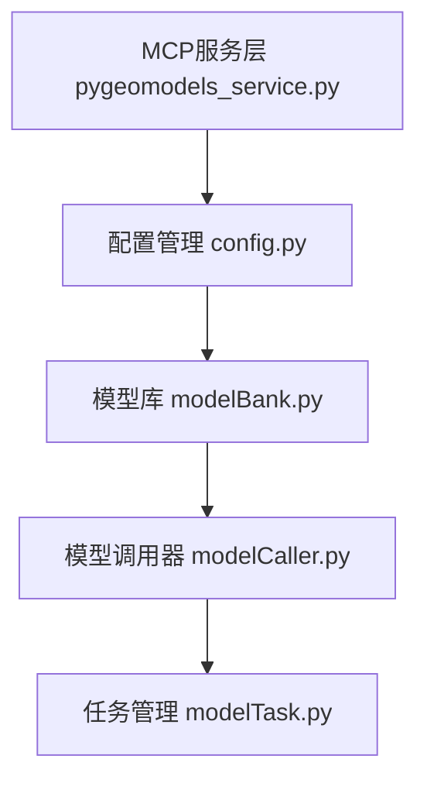

# PyGeoModels MCP服务代码文档

## 概述

PyGeoModels MCP服务是一个基于FastMCP框架的地理模型调用服务，为LLM提供地理空间建模工具的访问接口。该服务封装了地理模型的调用、状态查询和日志管理等功能。

## 核心功能

### 1. 模型管理
- **list_categories()**: 列出所有可用的模型类别
- **list_models_by_category(category)**: 列出指定类别下的所有地理模型
- **describe_model(model_name)**: 获取指定模型的详细参数定义

### 2. 任务执行
- **run_model(request_body)**: 提交地理模型任务
- **get_task_status(project_id)**: 查询任务执行状态
- **get_task_log(project_id)**: 获取任务执行日志

### 3. 数据查询
- **ready**: 查询系统状态

## 架构设计




## EGC服务API详细说明

### API端点映射

> 💡 **基础配置**: 所有API基于 `http://localhost:7504/mbms/v1` 构建（可在 `default_config.ini` 中配置）

#### 1. list_categories() - 获取模型类别

**实际路径**:
```
GET http://localhost:7504/mbms/v2/model-manager/general-models/catalog/categories
```

**实现位置**: `pygeomodels/modelBank.py` - `set_categories()`

**响应示例**:
```json
{
  "success": true,
  "data": {
    "categories": [
      {"id": "basic", "name": "基础分析"},
      {"id": "interpolation", "name": "空间插值"}
    ]
  }
}
```

---

#### 2. list_models_by_category(category) - 获取指定类别的模型列表

这是一个**复合操作**，涉及两个EGC API调用：

##### 步骤1: 获取模型ID列表

**实际路径**:
```
GET http://localhost:7504/mbms/v2/model-manager/general-single-models/list?categoryId=basic&modelName=&description=&semantic=&auditStatus=&page=&size=40
```

**实现位置**: `pygeomodels/modelBank.py` - `_load_models_by_category()`

##### 步骤2: 获取每个模型的详细信息

**实际路径** (对每个模型ID):
```
GET http://localhost:7504/mbms/v1/model-manager/general-single-models/pitRemove/info
GET http://localhost:7504/mbms/v1/model-manager/general-single-models/slopeAnalysis/info
```

**实现位置**: `pygeomodels/modelBank.py` - `set_models_metadata()`

---

#### 3. describe_model(model_name) - 获取模型详细元数据

**实际路径**:
```
GET http://localhost:7504/mbms/v1/model-manager/general-single-models/pitRemove/info
```

**实现位置**: `pygeomodels/modelBank.py` - `describe_model()`

---

#### 4. run_model(request_body) - 提交模型任务

**实际路径**:
```
POST http://localhost:7504/mbms/v1/model-runner/single-models/pitRemove/run
```

**实现位置**: `pygeomodels/modelCaller.py` - 动态生成的模型方法

**请求体示例**:
```json
{
  "inputs": {"dem": "/path/to/input_dem.tif"},
  "params": {"algorithm": "horn"},
  "outputs": {"dem": "/path/to/output_dem.tif"},
  "task_name": "DEM填洼任务"
}
```

---

#### 5. get_task_status(project_id) - 查询任务状态

**实际路径**:
```
GET http://localhost:7504/mbms/v1/user-projects/proj_12345678/progress
```

**实现位置**: `pygeomodels/modelTask.py` - `progress()`

---

#### 6. get_task_log(project_id) - 获取任务日志

**实际路径**:
```
GET http://localhost:7504/mbms/v1/user-projects/proj_12345678/log
```

**实现位置**: `pygeomodels/modelTask.py` - `log()`

---

### API认证

所有EGC API调用都需要Bearer Token认证：

```bash
Authorization: Bearer {access_token}
```

Token获取方式：
1. **请求头传递**: 从MCP请求的 `Authorization` 头中提取
2. **测试配置**: 从 `local_config.ini` 的 `test_bearer_token` 读取（仅开发环境）
3. **Keycloak认证**: 从配置的Keycloak服务器动态获取（生产环境）

---

### 缓存机制

为优化性能，`modelBank` 实现了多层缓存：

| 缓存项 | 说明 |
|--------|------|
| 模型类别 | 缓存类别列表 |
| 模型ID列表 | 缓存所有模型ID |
| 类别-模型映射 | 缓存类别与模型的关系 |
| 模型元数据 | 缓存每个模型的详细信息 |

**缓存失效条件**: Token变化时，所有相关缓存失效


## 对LLM调用的适用性评估

### 优点
1. **清晰的接口设计**: 工具函数职责明确，便于LLM理解和调用
2. **完整的工作流程**: 从模型发现到任务执行再到结果查询的完整链路
3. **标准化输出**: 返回格式统一，便于LLM处理结果
4. **类型提示**: 使用了TypeScript风格的类型注解

### 不足
1. **文档不够详细**: 缺少参数格式说明和使用示例
2. **错误处理不完善**: 缺少统一的异常处理机制

## 主要问题识别

### 1. 错误处理不一致
```python
def run_model(request_body: Dict[str, Any]) -> Optional[str]:
    # 只检查了model_name，但没有验证其他必需参数
    model_name = request_body.get("model_name")
    if model_name is None:
        raise ValueError("model_name must be provided in the request body.")
```

## 改进建议

### 1. 统一错误处理
```python
def error_handler(func):
    """统一错误处理装饰器"""
    def wrapper(*args, **kwargs):
        try:
            initialize()
            return func(*args, **kwargs)
        except Exception as e:
            return {"error": str(e), "success": False}
    return wrapper
```

### 2. 增强文档说明
```python
@mcp.tool()
def run_model(request_body: Dict[str, Any]) -> Optional[str]:
    """
    提交地理模型任务
    
    Args:
        request_body: 任务请求体，包含以下字段：
            - model_name (str): 模型名称，必填
            - inputs (Dict): 输入参数，必填
            - params (Dict): 模型参数，可选
            - outputs (Dict): 输出配置，必填
            - task_name (str): 任务名称，可选
    
    Returns:
        str: 任务ID，用于后续状态查询
        
    Raises:
        ValueError: 参数验证失败
        AttributeError: 模型不存在
    
    Example:
        request_body = {
            "model_name": "slope_analysis",
            "inputs": {"dem": "/path/to/dem.tif"},
            "params": {"algorithm": "horn"},
            "outputs": {"slope": "/path/to/slope.tif"},
            "task_name": "坡度分析任务"
        }
    """
```

### 3. 完善输入验证
```python
def validate_request_body(request_body: Dict[str, Any]) -> None:
    """验证请求体参数"""
    required_fields = ["model_name", "inputs", "outputs"]
    for field in required_fields:
        if field not in request_body:
            raise ValueError(f"缺少必需参数: {field}")
```

### 4. 改进状态查询
```python
@mcp.tool()
def get_task_status(project_id: str) -> Dict[str, Any]:
    """
    查询任务状态
    
    Returns:
        Dict: 包含状态信息的字典
            - status (str): 任务状态
            - progress (float): 进度百分比
            - message (str): 状态描述
    """
    try:
        task = modelTask(cfg, project_id)
        return {
            "status": task.progress(),
            "project_id": project_id,
            "success": True
        }
    except Exception as e:
        return {
            "error": str(e),
            "project_id": project_id,
            "success": False
        }
```

## 推荐的重构方案

### 1. 采用类封装
```python
class PyGeoModelsService:
    def __init__(self):
        self.cfg = None
        self.mb = None
        self.initialize()
    
    def initialize(self):
        """初始化服务"""
        # 初始化逻辑
        pass
```

### 2. 添加配置验证
```python
def validate_config(cfg):
    """验证配置文件的完整性"""
    required_sections = ["server", "models", "storage"]
    for section in required_sections:
        if section not in cfg:
            raise ValueError(f"配置文件缺少必需节: {section}")
```

### 3. 实现异步支持
```python
import asyncio

@mcp.tool()
async def run_model_async(request_body: Dict[str, Any]) -> str:
    """异步提交模型任务"""
    # 异步实现
    pass
```

## 总结

PyGeoModels MCP服务提供了完整的地理模型管理和执行功能，通过多层缓存机制优化了性能。

### 核心优势

1. **清晰的API层次**: 从类别发现 → 模型查询 → 详细信息 → 任务执行的完整流程
2. **智能缓存机制**: Token关联的多层缓存，减少重复API调用
3. **灵活的认证**: 支持请求头传递、测试配置、Keycloak动态认证
4. **完整的任务管理**: 从提交到状态查询到日志获取的全生命周期管理

### 使用建议

1. **首次调用**: 使用 `list_categories()` 了解可用的模型分类
2. **模型发现**: 通过 `list_models_by_category(category)` 浏览类别下的模型
3. **参数了解**: 用 `describe_model(model_name)` 获取模型的输入输出定义
4. **任务执行**: 构建正确的请求体，通过 `run_model()` 提交任务
5. **状态跟踪**: 使用返回的 `project_id` 查询任务状态和日志

### 性能考虑

- **首次调用慢**: `list_models_by_category` 首次调用需要获取所有模型元数据
- **后续调用快**: 利用缓存机制，相同token下的重复查询几乎无延迟
- **Token变化**: 切换用户或token时缓存失效，需要重新加载

### 相关文档

- 完整的API使用指南: `docs/MCP_EGC_Tools_API_Usage.md`
- 配置说明: `pygeomodels/default_config.ini`
- 使用示例: `examples/ex01_submit_model_task.py`
- 测试工具: `test_mcp_service.py`
