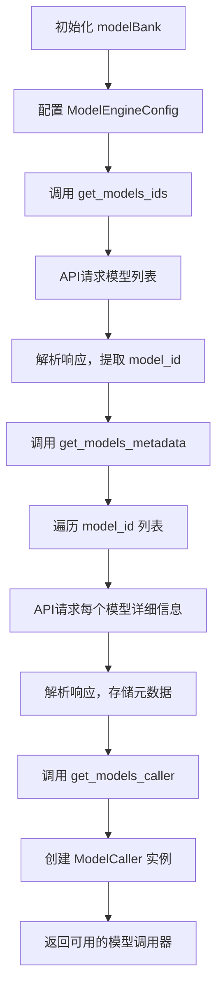

## modelBank 类工作原理

`modelBank` 类是一个模型仓库管理器，负责从远程模型管理服务获取模型信息并管理模型调用器。

### 1. 初始化过程

```python
# 创建配置对象
cfg = ModelEngineConfig(config_parser)
# 初始化模型仓库
mb = modelBank(cfg)
```

初始化时，`modelBank` 会：
- 保存配置对象 `cfg`
- 初始化三个私有属性：
  - `_models_ids`: 存储模型ID列表
  - `_models_metadata`: 存储模型元数据字典
  - `_models_caller`: 存储模型调用器对象

### 2. 获取模型列表的实际过程

当调用 `get_models_ids()` 时：

```python
# 实际API调用
GET http://modelmanager:7504/mbms/v1/model-manager/general-single-models/list?modelName=&description=&categoryId=&semantic=&auditStatus=&page=&size=40
```

**实际响应数据示例：**
```json
{
    "success": true,
    "data": {
        "content": [
            {
                "model_id": "d974f7e7-75eb-3ca4-bdf4-2f143543de12",
                "auditStatus": 2,
                "auditComments": "审核通过",
                "maintainer": "Xingchen Fan",
                "categoryName": "通用基础分析",
                "identification": {
                    "model_name": "两条线的夹角",
                    "semantic": "line angle",
                    "description": "test"
                }
            },
            {
                "model_id": "827a0ed4-eb81-3cd5-b84f-871166368115",
                "auditStatus": 2,
                "auditComments": "审核通过",
                "maintainer": "Han Li",
                "categoryName": "通用基础分析",
                "identification": {
                    "model_name": "欧氏距离分析",
                    "semantic": "Euclidean distance analysis",
                    "description": "基于欧氏距离对矢量数据进行分析"
                }
            }
        ]
    }
}
```

**处理结果：**
```python
self._models_ids = [
    "d974f7e7-75eb-3ca4-bdf4-2f143543de12",
    "827a0ed4-eb81-3cd5-b84f-871166368115"
]
```

### 3. 获取模型元数据的实际过程

当调用 `get_models_metadata()` 时，会为每个模型ID调用详细信息API：

```python
# 对每个模型ID调用详细信息API
GET http://modelmanager:7504/mbms/v1/model-manager/general-single-models/{model_id}/info
```

**实际响应数据示例（以欧氏距离分析模型为例）：**
```json
{
    "success": true,
    "data": {
        "model_id": "827a0ed4-eb81-3cd5-b84f-871166368115",
        "model_unique_abbr": "euclidean_distance_analysis",
        "version": "1.0",
        "identification": {
            "model_name": "欧氏距离分析",
            "semantic": "Euclidean distance analysis",
            "description": "基于欧氏距离对矢量数据进行分析",
            "category_application": "通用基础型",
            "category_data": ["点数据分析"],
            "keywords": ["距离计算", "几何对象"]
        },
        "parameter_info": {
            "parameters": [
                {
                    "arg_name": "sfp",
                    "param_type": "input_data",
                    "name": "输入文件",
                    "description": "输入为shp格式的矢量文件",
                    "data_type": "shp",
                    "required": true
                },
                {
                    "arg_name": "width",
                    "param_type": "param",
                    "name": "图像宽度",
                    "description": "距离分析后的影像宽度",
                    "data_type": "int",
                    "required": true,
                    "specification": {
                        "default": "424"
                    }
                },
                {
                    "arg_name": "height",
                    "param_type": "param",
                    "name": "图像高度",
                    "description": "距离分析后的影像高度",
                    "data_type": "int",
                    "required": true,
                    "specification": {
                        "default": "317"
                    }
                },
                {
                    "arg_name": "op",
                    "param_type": "output_data",
                    "name": "输出文件",
                    "description": "距离分析后输出tif格式的文件",
                    "data_type": "tif",
                    "required": true
                }
            ]
        },
        "application": {
            "domain": "欧式距离分析",
            "objective": "对于线要素进行欧式距离分析",
            "mechanism": "通过输入的图片尺寸来自动计算分辨率大小，对线状要素进行欧氏距离分析"
        },
        "operation": {
            "usage": "通过指明输入的shp文件路径，tif图的大小，和输出文件路径来进行欧式距离分析",
            "exec_example": [
                "python3 ./src/EuclideanDistance.py -sfp ./data/waterways.shp -width 94 -height 69 -op ./waterways_distance.tif"
            ]
        },
        "technique": {
            "language": ["python"],
            "os": ["Windows", "Linux", "MacOS"],
            "hardware": ["CPU"],
            "dependencies": [
                {"name": "fiona", "version": "1.10.1"},
                {"name": "numpy", "version": "1.24.3"},
                {"name": "rasterio", "version": "1.3.10"},
                {"name": "scipy", "version": "1.10.1"}
            ]
        }
    }
}
```

**处理结果：**
```python
self._models_metadata = {
    "827a0ed4-eb81-3cd5-b84f-871166368115": {
        # 完整的模型元数据
    },
    "d974f7e7-75eb-3ca4-bdf4-2f143543de12": {
        # 另一个模型的完整元数据
    }
}
```

### 4. 便捷方法的使用

#### `list_all_models()` 方法
```python
models_list = mb.list_all_models()
# 返回结果：
[
    {
        "model_id": "827a0ed4-eb81-3cd5-b84f-871166368115",
        "name": "euclidean_distance_analysis",
        "description": "基于欧氏距离对矢量数据进行分析"
    },
    {
        "model_id": "d974f7e7-75eb-3ca4-bdf4-2f143543de12", 
        "name": "line_angle",
        "description": "test"
    }
]
```

#### `describe_model()` 方法
```python
model_info = mb.describe_model("827a0ed4-eb81-3cd5-b84f-871166368115")
# 返回该模型的完整元数据
```

### 5. 模型调用器的创建

当调用 `get_models_caller()` 时：

```python
caller = mb.get_models_caller()
# 创建 ModelCaller 实例，传入配置和所有模型的元数据
# caller 可以用于实际执行模型任务
```

### 6. 工作流程图



### 7. 关键特性

1. **懒加载机制**：只有在需要时才调用API获取数据
2. **缓存机制**：获取的数据会缓存在实例中，避免重复请求
3. **错误处理**：API调用失败时会打印错误信息
4. **数据封装**：提供便捷方法访问模型信息
5. **统一管理**：集中管理所有模型的元数据和调用器

这个类作为模型仓库的核心组件，为上层应用提供了统一的模型管理和调用接口。

```python
# 创建配置对象
cfg = ModelEngineConfig(config_parser)
# 初始化模型仓库
mb = modelBank(cfg)
```

```python
# 实际API调用
GET http://modelmanager:7504/mbms/v1/model-manager/general-single-models/list?modelName=&description=&categoryId=&semantic=&auditStatus=&page=&size=40
```

```json
{
    "success": true,
    "data": {
        "content": [
            {
                "model_id": "d974f7e7-75eb-3ca4-bdf4-2f143543de12",
                "auditStatus": 2,
                "auditComments": "审核通过",
                "maintainer": "Xingchen Fan",
                "categoryName": "通用基础分析",
                "identification": {
                    "model_name": "两条线的夹角",
                    "semantic": "line angle",
                    "description": "test"
                }
            },
            {
                "model_id": "827a0ed4-eb81-3cd5-b84f-871166368115",
                "auditStatus": 2,
                "auditComments": "审核通过",
                "maintainer": "Han Li",
                "categoryName": "通用基础分析",
                "identification": {
                    "model_name": "欧氏距离分析",
                    "semantic": "Euclidean distance analysis",
                    "description": "基于欧氏距离对矢量数据进行分析"
                }
            }
        ]
    }
}
```

```python
self._models_ids = [
    "d974f7e7-75eb-3ca4-bdf4-2f143543de12",
    "827a0ed4-eb81-3cd5-b84f-871166368115"
]
```

```python
# 对每个模型ID调用详细信息API
GET http://modelmanager:7504/mbms/v1/model-manager/general-single-models/{model_id}/info
```

```json
{
    "success": true,
    "data": {
        "model_id": "827a0ed4-eb81-3cd5-b84f-871166368115",
        "model_unique_abbr": "euclidean_distance_analysis",
        "version": "1.0",
        "identification": {
            "model_name": "欧氏距离分析",
            "semantic": "Euclidean distance analysis",
            "description": "基于欧氏距离对矢量数据进行分析",
            "category_application": "通用基础型",
            "category_data": ["点数据分析"],
            "keywords": ["距离计算", "几何对象"]
        },
        "parameter_info": {
            "parameters": [
                {
                    "arg_name": "sfp",
                    "param_type": "input_data",
                    "name": "输入文件",
                    "description": "输入为shp格式的矢量文件",
                    "data_type": "shp",
                    "required": true
                },
                {
                    "arg_name": "width",
                    "param_type": "param",
                    "name": "图像宽度",
                    "description": "距离分析后的影像宽度",
                    "data_type": "int",
                    "required": true,
                    "specification": {
                        "default": "424"
                    }
                },
                {
                    "arg_name": "height",
                    "param_type": "param",
                    "name": "图像高度",
                    "description": "距离分析后的影像高度",
                    "data_type": "int",
                    "required": true,
                    "specification": {
                        "default": "317"
                    }
                },
                {
                    "arg_name": "op",
                    "param_type": "output_data",
                    "name": "输出文件",
                    "description": "距离分析后输出tif格式的文件",
                    "data_type": "tif",
                    "required": true
                }
            ]
        },
        "application": {
            "domain": "欧式距离分析",
            "objective": "对于线要素进行欧式距离分析",
            "mechanism": "通过输入的图片尺寸来自动计算分辨率大小，对线状要素进行欧氏距离分析"
        },
        "operation": {
            "usage": "通过指明输入的shp文件路径，tif图的大小，和输出文件路径来进行欧式距离分析",
            "exec_example": [
                "python3 ./src/EuclideanDistance.py -sfp ./data/waterways.shp -width 94 -height 69 -op ./waterways_distance.tif"
            ]
        },
        "technique": {
            "language": ["python"],
            "os": ["Windows", "Linux", "MacOS"],
            "hardware": ["CPU"],
            "dependencies": [
                {"name": "fiona", "version": "1.10.1"},
                {"name": "numpy", "version": "1.24.3"},
                {"name": "rasterio", "version": "1.3.10"},
                {"name": "scipy", "version": "1.10.1"}
            ]
        }
    }
}
```

```python
self._models_metadata = {
    "827a0ed4-eb81-3cd5-b84f-871166368115": {
        # 完整的模型元数据
    },
    "d974f7e7-75eb-3ca4-bdf4-2f143543de12": {
        # 另一个模型的完整元数据
    }
}
```

```python
models_list = mb.list_all_models()
# 返回结果：
[
    {
        "model_id": "827a0ed4-eb81-3cd5-b84f-871166368115",
        "name": "euclidean_distance_analysis",
        "description": "基于欧氏距离对矢量数据进行分析"
    },
    {
        "model_id": "d974f7e7-75eb-3ca4-bdf4-2f143543de12", 
        "name": "line_angle",
        "description": "test"
    }
]
```

```python
model_info = mb.describe_model("827a0ed4-eb81-3cd5-b84f-871166368115")
# 返回该模型的完整元数据
```

```python
caller = mb.get_models_caller()
# 创建 ModelCaller 实例，传入配置和所有模型的元数据
# caller 可以用于实际执行模型任务
```

```plaintext
graph TD
    A[初始化 modelBank] --> B[配置 ModelEngineConfig]
    B --> C[调用 get_models_ids]
    C --> D[API请求模型列表]
    D --> E[解析响应，提取 model_id]
    E --> F[调用 get_models_metadata]
    F --> G[遍历 model_id 列表]
    G --> H[API请求每个模型详细信息]
    H --> I[解析响应，存储元数据]
    I --> J[调用 get_models_caller]
    J --> K[创建 ModelCaller 实例]
    K --> L[返回可用的模型调用器]
```

